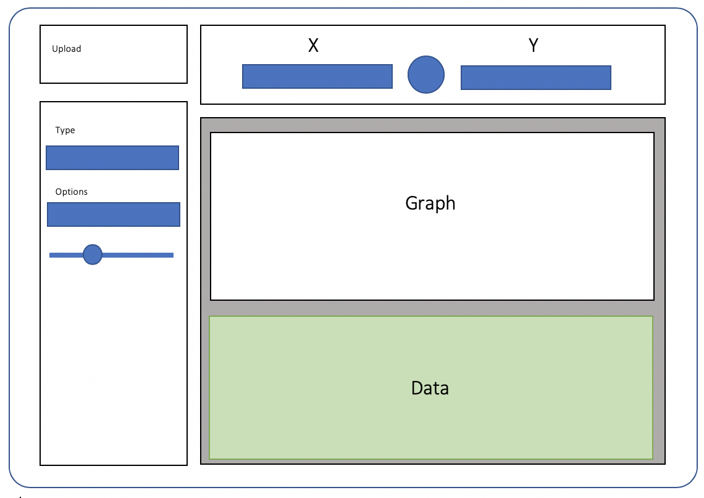

```{r setup, include=FALSE}
knitr::opts_chunk$set(echo = TRUE, eval = F)
```

\newpage

## Objectif du projet

L'objectif de l'application est de répondre au sujet n°2 c'est-à-dire de pouvoir mener une **analyse exploratoire** d'un jeu de données avec description et visualisation des données numériques et catégorielles. En outre, la distribution des variables individuelles doit être observable ainsi que la visualisation et le croisement de deux variables.

Pour répondre à cet objectif, nous avons décidé de construire une application Shiny qui, à partir d'un jeu de données importé :

- permet de visualiser la ou les variables sélectionnée(s) sur un graphique ;
- permet de personnaliser les options d'affichage de ce graphique sur la barre latérale ;
- affiche des données sous forme de tableaux.

## Description de l'interface utilisateur

Nous avons commencé par dresser une maquette de l'application :

```{r, out.width='50%', fig.align='center', fig.cap='Maquette de l\'application (ecran principal)', echo=FALSE, eval=T, fig.pos='h'}

```

Nous avons choisi de faire fonctionner l'application en deux temps. Dans un premier temps une interface apparait au lancement et propose d'importer un jeu de données. Dans un second temps, l'écran principal apparait.

Cet écran principal est constitué de deux parties : une barre latérale (`sidebarPanel`) sur la gauche et une partie graphique et données sur la droite (`mainPanel`). 

La barre latérale sert à paramètrer les options du graphique et à importer un nouveau jeu de données. La sélection des variables se fait alors dans le `mainPanel`, au dessus du graphique. Certaines variables catégorielles sont codées avec des numéros et sont alors considérées comme numériques. C'est pourquoi nous avons ajouté une case à cocher "Discrète" pour chaque variable afin que l'utilisateur fasse interprétér la variable comme catégorielle par le serveur.

La fonction `option_to_add` facilite l'ajout d'un panel relatif au paramétrage d'une option dans l'UI. Cette fonction écrit automatiquement un paneau `sliderInput` ou `selectInput` en fonction de l'option. Les noms des options nécessitant un `sliderInput` sont dans le vecteur `options_slider` et celles nécessitant un `selectInput` sont dans le vecteur `options_select`. 

## Production du graphique

Le graphique est obtenu en utilisant le package `ggplot2`.

L'utilisateur choisit la ou les variable(s) à afficher et en fonction du type des variables, catégorielles (discrètes) ou numériques (continues), un type de graphique est utilisé par défaut. L'utilisateur peut ensuite choisir un autre type de graphique grace à un menu déroulant. La liste des types de graphiques change en fonction de si l'utilisateur choisit d'afficher une variable ou de croiser deux variables.

La fonction `graph_type` modifie les options contenues dans le vecteur `options_graph` en fonction du type de graphique et retourne le type de graphique à produire selon la syntaxe de `ggplot2`.

### Réactivité

Pour gérer la réactivité, des variables réactives sont créées à partir du choix de l'utilisateurs avec la fonction `create_variable`.

Nous avons utilisé les fonctions `is.factor` et `is.character` pour déterminer le type des variables, considérant que toute variable en chaine de charactères est catégorielle.

Le type de variable est ensuite géré par deux éléments :

- La case à cocher "Discrète", qui agit sur le type de graphique à produire, contenue dans `input$disc_varX` où X est le numéro de la variable. Elle est cochée par défaut si `is.factor` ou `is.character` renvoie `TRUE` pour la variable donnée.
- La variable `output$varX_type`, qui détermine automatiquement le type de la variable indépendament de l'utilisateur. Elle ne sert qu'au niveau de l'UI et elle est créée par la fonction `type_variables`.

Dans le serveur, un type de graphique est ensuite sélectionné automatiquement en mettant à jour le menu déroulant.Pour un graphique à une variable nous avons fait les choix suivants :

- Si la variable est discrète, un graphique à barre (histogramme) est affiché par défaut avec `geom_bar`
- Si la variable est continue, sa distribution est affichée avec `geom_density`

La fonction `graph_aes` permet de réorganier les abscisses pour un graph à une variable.
La fonction `aes_to_use` sert a sélectionner les données à utiliser pour le graph. En effet, 

## Production des tableaux

