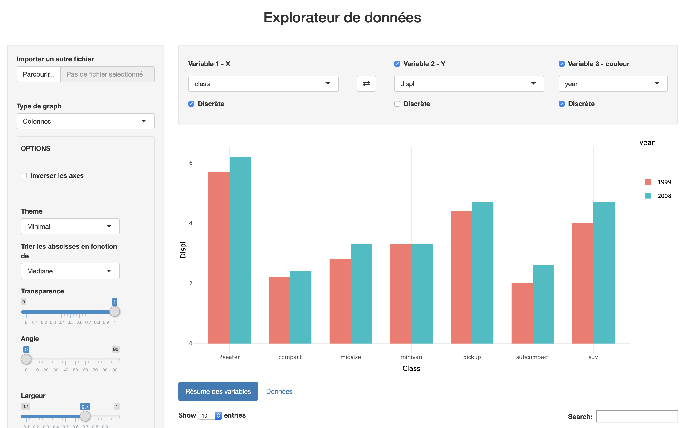

```{r setup, include=FALSE}
knitr::opts_chunk$set(echo = TRUE, eval = F)
```

\newpage

## Objectif du projet

L'objectif de l'application est de répondre au sujet n°2 c'est-à-dire de pouvoir mener une **analyse exploratoire** d'un jeu de données avec description et visualisation des données numériques et catégorielles. En outre, la distribution des variables individuelles doit être observable ainsi que la visualisation et le croisement de deux variables.

Pour répondre à cet objectif, nous avons décidé de construire une application Shiny qui, à partir d'un jeu de données importé :

- permet de visualiser la ou les variables sélectionnée(s) sur un graphique ;
- permet de personnaliser les options d'affichage de ce graphique sur la barre latérale ;
- affiche des données sous forme de tableaux.

## Description de l'interface utilisateur

Nous avons commencé par dresser une maquette de l'application :

```{r, out.width='50%', fig.align='center', fig.cap='Maquette de l\'application (ecran principal)', echo=FALSE, eval=T, fig.pos='h'}
knitr::include_graphics('images/maquette.png')
```

Nous avons choisi de faire fonctionner l'application en deux temps. Dans un premier temps une interface apparait au lancement et propose d'importer un jeu de données. Dans un second temps, l'écran principal apparait.

Cet écran principal est constitué de deux parties : une barre latérale (`sidebarPanel`) sur la gauche et une partie graphique et données sur la droite (`mainPanel`). 

La barre latérale sert à paramètrer les options du graphique et à importer un nouveau jeu de données. La sélection des variables se fait alors dans le `mainPanel`, au dessus du graphique. Certaines variables catégorielles sont codées avec des numéros et sont alors considérées comme numériques. C'est pourquoi nous avons ajouté une case à cocher "Discrète" pour chaque variable afin que l'utilisateur fasse interprétér la variable comme catégorielle par le serveur.

La fonction `option_to_add` facilite l'ajout d'un panel relatif au paramétrage d'une option dans l'UI. Cette fonction écrit automatiquement un paneau `sliderInput` ou `selectInput` en fonction de l'option. Les noms des options nécessitant un `sliderInput` sont dans le vecteur `options_slider` et celles nécessitant un `selectInput` sont dans le vecteur `options_select`. 

## Production du graphique

Le graphique est obtenu en utilisant le package `ggplot2`.

L'utilisateur choisit la ou les variable(s) à afficher et en fonction du type des variables, catégorielles (discrètes) ou numériques (continues), un type de graphique est utilisé par défaut. L'utilisateur peut ensuite choisir un autre type de graphique grace à un menu déroulant. La liste des types de graphiques change en fonction de si l'utilisateur choisit d'afficher une variable ou de croiser deux variables.

La fonction `graph_type` modifie les options contenues dans le vecteur `options_graph` en fonction du type de graphique et retourne le type de graphique à produire selon la syntaxe de `ggplot2`.

### Réactivité

Pour gérer la réactivité, des variables réactives sont créées à partir du choix de l'utilisateurs avec la fonction `create_variable`.

Nous avons utilisé les fonctions `is.factor` et `is.character` pour déterminer le type des variables, considérant que toute variable en chaine de caractères est catégorielle.

Le type de variable est ensuite géré par deux éléments :

- La case à cocher "Discrète", qui agit sur le type de graphique à produire, contenue dans `input$disc_varX` où X est le numéro de la variable. Elle est cochée par défaut si `is.factor` ou `is.character` renvoie `TRUE` pour la variable donnée.
- La variable `output$varX_type`, qui détermine automatiquement le type de la variable indépendament de l'utilisateur. Elle ne sert qu'au niveau de l'UI et elle est créée par la fonction `type_variables`.

Dans le serveur, un type de graphique est ensuite sélectionné automatiquement en mettant à jour le menu déroulant. Pour un graphique à une variable nous avons fait les choix suivants :

- Si la variable est discrète, un graphique à barre (histogramme) est affiché par défaut avec `geom_bar` avec en abscisse les effectifs pour chaque catégories. Il y a la possibilité d'afficher plutot les pourcentages avec une case à cocher.
- Si la variable est continue, sa distribution est affichée avec `geom_density`

Pour un graphique avec deux variables : 

- Si la variable en abscisses est discrète et celle en ordonnées continue, un graphique en boite à moustache est affiché par défaut avec `geom_boxplot`. Nous avons choisit ce type de graphique par défaut car il permet d'emblée d'afficher plusieurs informations (médiane, quartiles, min et max). L'utilisateur peut aussi afficher un graphique en colonnes `geom_col` avec ces types de variables. Les boites à moustaches et les colonnes sont par défaut ordonnées en fonction de la *médiane* de la variable en ordonnées, croissante. L'utilisateur a aussi la possibilité de les ordonner selon la *moyenne* croissante avec le menu déroulant "Trier les abscisses en fonction de".
- Si les deux variables sont continues, un nuage de points est affiché avec `geom_jitter`. Il y a la possibilité d'ajouter une courbe pour décrire la tendance avec `geom_smooth` en cochant une case ou alors d'afficher la courbe seulement en changeant le type de graphique sur "Courbe".
- Si la variable en abscisses est continue et celle en ordonnées discrète, un graphique en ligne est affichée avec `geom_line`.
- Si les deux variables sont discrètes, un graphique en cercles est affichée avec `geom_count`.

Les deux derniers choix on été fait en se référant à l'aide-mémoire du package `ggplot2`.

### Tri des données

Pour un histogramme à une variables, c'est la fonction `graph_aes` qui permet de réorganier les abscisses selon un ordre croissant en fonction de la moyenne ou de la médiane de la valeur en ordonnées.

Pour trier les colonnes d'un histogramme à deux variables nous avons utilisé le package `dplyr` dans la fonction `data_to_use`. Cette fonction a en fait pour objectif de redéfinir l'ordre des niveaux des facteurs car c'est cet ordre qui est utilisé par `ggplot` pour ranger les colonnes. Pour se faire elle regroupe les données en fonction de la variable choisie en abscisses puis elle aggrège ses données en fonction, soit de la moyenne, soit de la médiane, de la variable en ordonnées selon le choix de l'utilisateur. C'est la fonction `fct_tri` qui écrit cette ligne d'aggrégation en nommant la colonne ainsi obtenue "mean" ou "median", ceci afin de permettre la réutilisation de `input$fct_tri` (la fonction de tri choisie par l'utilisateur) avec `arrange`. Une nouvelle colonne avec les niveaux ordonnées est ensuite créée. Enfin, les colonnes d'intérêt sont isolées : la colonne contenant la variable 1 avec les niveaux réordonnés, celle contenant la variable 2 et éventuellement celle contenant la variable 3 (on supprime en fait la colonne qui contenait la variable 1 avec niveaux non-ordonnés).

Pour un graphique à boites à moustaches, c'est la fonction `aes_to_use` qui trie les abscisses selon la moyenne ou la médiane de la valeur en ordonnées. En outre, cette fonction selectionne le jeu de données approprié en fonction du type de graphique et renvoie les `aes` à utiliser.

### Couleur

Nous avons ajouté la possibilité pour l'utilisateur de choisir de colorier le graphique avec une troisième variable, créant ainsi des groupes.

## Production des tableaux

Nous avons décidé de produire deux tableaux, accessibles via des onglets :

- un tableau "Résumé des variables", produit avec le package `desctable`, qui dresse la liste des variables du jeu de données accompagnées de statistiques les concernant.
- un tableau "Données" qui présente le jeu de données à l'état brut, avec la possibilité de filtrer les colonnes selon une valeur et de rechercher une valeur dans le jeu de données.

## Aperçu de l'application

```{r, out.width='75%', fig.align='center', fig.cap='Ecran principal de l\'application', echo=FALSE, eval=T, fig.pos='h'}

```
